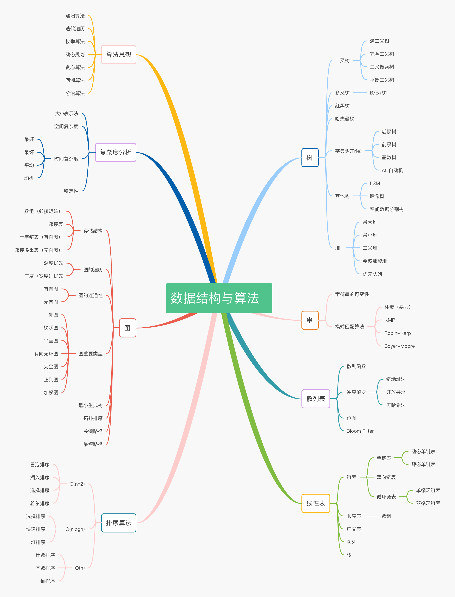

# [LeetCode](https://leetcode.com) 的 Go 解答

## 为什么要学习算法与数据结构

对一名开发者来讲，学习算法与数据结构的意义何在？特别是没有系统学习过计算机专业的开发者。拿我自己来讲，在平常的编码工作中，基本上不需要亲自实现一个链表或排序算法；大多数工作内容都是重复性的，业务分支和逻辑分支占比编码得 70% ；日常缺少对算法与数据结构系统性的认识，目前停留在脑子里面的算法大多是曾经死记硬背的，换句话说，至今还没能够真正理解和运用算法与数据结构。在这里我将开始系统学习并记录解题心得。

对于一名开发者来讲，学习算法与数据结构的好处有：

- 编程的内功修炼（写出性能更优的代码）
- 去国内⼀一流互联⽹网公司的必要条件
- 算法和数据结构是有趣且实⽤用的
- 看清楚系统架构后面本质逻辑实现

## 如何有效学习和训练算法与数据结构

多练习，多动手，常规技巧熟记～多看别人优秀的代码

- Chunk it up（切碎知识点）
- Deliberate practicing（刻意练习）
- Feedback (获得反馈)
- 难

## 数据结构

在计算机科学中，数据结构（英语：data structure）是计算机中存储、组织数据的方式。

正确的数据结构选择可以提高算法的效率。在计算机程序设计的过程中，选择适当的数据结构是一项重要工作。许多大型系统的编写经验显示，程序设计的困难程度与最终成果的质量与表现，取决于是否选择了最适合的数据结构。

### 常见的数据结构

- Stack
- Queue / PriorityQueue
- Array
- Linked List (single list/double lists)
- Tree / Binary Search Tree
- Graph
- Heap
- Hash table
- LRU Cache
- …

## 算法

算法（algorithm），在数学（算学）和计算机科学之中，为任何一系列良定义的具体计算步骤，常用于计算、数据处理和自动推理。作为一个有效方法，算法被用于计算函数，它包含了一系列定义清晰的指令，并可于有限的时间及空间内清楚的表述出来。

算法的核心是创建问题抽象的模型和明确求解目标，之后可以根据具体的问题选择不同的模式和方法完成算法的设计。

### 常见的设计模式或实现方法

- Recursion/BackTrace
- Breadth-firth search
- Depth-firth search
- Divide and Conquer
- Dynamic Programming
- Binary Search
- Graph
- Greedy
- …

### 复杂度

时间复杂度和空间复杂度分别来表示算法需要消耗的时间资源和空间资源。

常见算法的 [Big-O Cheat Sheet](https://www.bigocheatsheet.com/)

### 稳定性

如果待排序的序列中存在值相等的元素，经过排序之后，相等元素之间原有的先后顺序不变。

我通过一个例子来解释一下。比如我们有一组数据 2，9，3，4，8，3，按照大小排序之后就是 2，3，3，4，8，9。

这组数据里有两个 3。经过某种排序算法排序之后，如果两个 3 的前后顺序没有改变，那我们就把这种排序算法叫作稳定的排序算法；如果前后顺序发生变化，那对应的排序算法就叫作不稳定的排序算法。

## 题目列表

## 感谢

- [aQuaYi](https://github.com/aQuaYi/LeetCode-in-Go)
