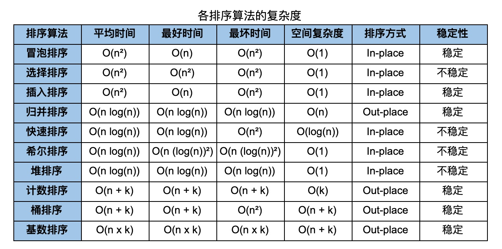

# 排序算法

十大经典排序算法时间复杂度和空间复杂度汇总图

不稳定排序算法记忆口诀：“快些选队”。
快：快速排序
些：希尔排序
选：选择排序
队：堆排序

## 细品文章

- 极客时间 《数据结构与算法之美》
    - 11 | 排序（上）：为什么插入排序比冒泡排序更受欢迎？
    - 12 | 排序（下）：如何用快排思想在O(n)内查找第K大元素？
    - 13 | 线性排序：如何根据年龄给100万用户数据排序？
    - 14 | 排序优化：如何实现一个通用的、高性能的排序函数？
    - 28 | 堆和堆排序：为什么说堆排序没有快速排序快？
    - 29 | 堆的应用：如何快速获取到Top 10最热门的搜索关键词？